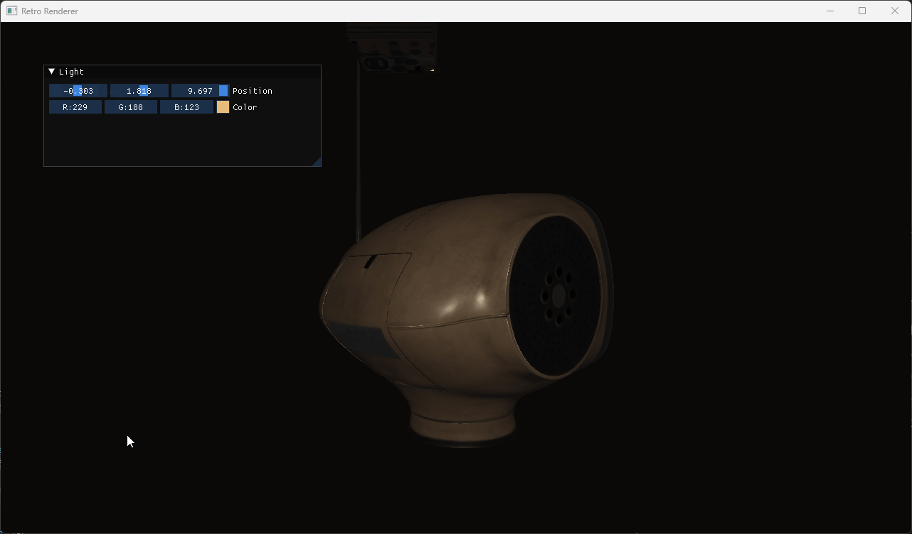

# Retro Renderer


Model from <https://skfb.ly/ooDDN>

## ✨ About

Retro Renderer is a graphics renderer being built on top of OpenGL and C++, it is currently under heavy development with multiple example projects to showcase the features it offers.

## 🚀 Installation and Usage

```sh
git clone https://github.com/faustinozanetto/retro-renderer # First clone the repo in your folder of choice.
```

## 🛠️ Technologies

The project is being developed with the latest technlogoies used in the industry like:

- C++
- OpenGL
- Premake
- GLFW
- GLAD
- GLM
- Spdlog
- DrWav
- And more :)

## 💻 Features

- Core
  - Assets managing with custom assets pack for serializing and serializing assets.
  - Model loading via assimp on runtime and asset packs in release.
  - Fully working audio system using OpenAL and support for .ogg and .wav files.
  - Simple camera system with perspective & orthographic support.
  - Events system for handling input and window events.
  - Input system with full support for all keys and buttons.
  - Logging system using spdlog with file sink support.
- Renderer
  - VAO and VBO support with custom layouts for definind data structure.
  - Simple frame buffer support with custom texture attachments.
  - Super basic lighting primitives support for spot and point lights.
  - Material system with custom pbr parameters and textures support.
  - Models and meshes support with custom moder loader.
  - Render buffer support.
  - Shaders system for loading shaders from file or from packaged asset pack.
  - Text rendering using custom loaded font file.
  - Textures system with lots of customization and options to load the data.
  - Simple but powerful windowing system.
- Physics
  - Implemented physics system using NVIDIA PhysX.
  - Support for both static and dynamic rigid bodies.
  - Complete support for multiple joints types such as D6 or Revolute joints.
  - Multiple collision shapes like box, sphere or plane.
- Profiling
  - Implemented tracy as the main profiling platform.

## 🎛️ Project Structure

The project is a structured in a single repo that consists of multiple separated projects.

- `retro`: the main project containing the source code of the renderer.
- `examples`: the folder where different example projects are located.

## 👤 Author

**Faustino Zanetto**

- Website: [@faustinozanetto](https://faustinozanetto.vercel.app)
- Twitter: [@faustinozanetto](https://twitter.com/faustinozanetto)
- Github: [@faustinozanetto](https://github.com/faustinozanetto)
- LinkedIn: [@faustinozanetto](https://linkedin.com/in/faustino-zanetto-4294a3213)