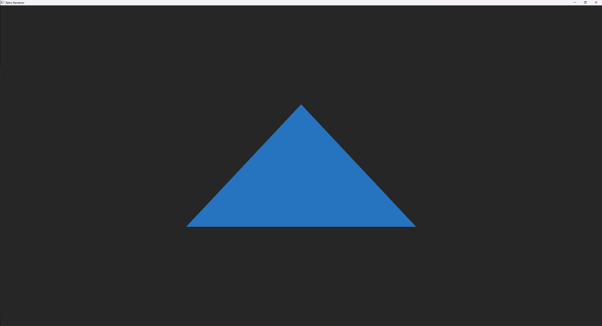
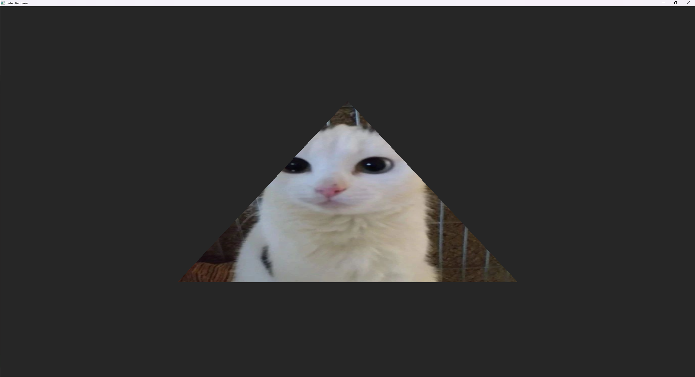
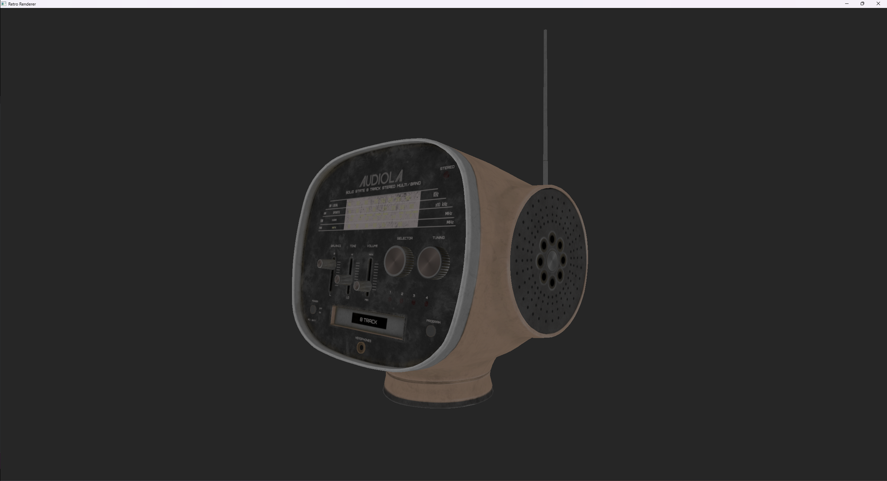
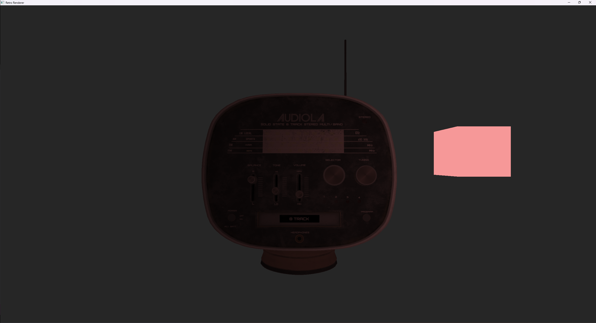
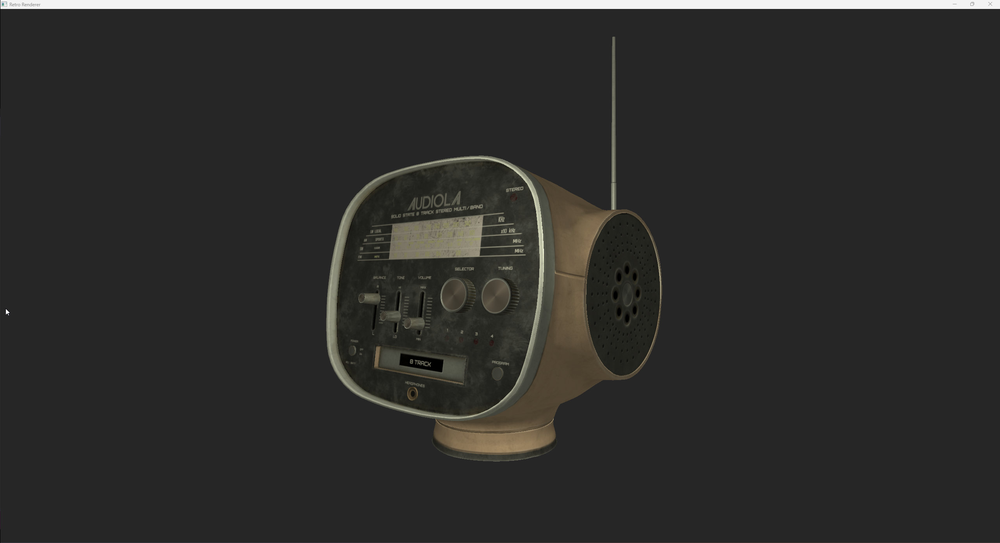

# Examples

This folder contains several examples that are using the retro renderer features. Here you can see some pictures of the results generated from the examples.

## Simple Triangle

## Simple Triangle Textured

## Simple 3D

## Simple Instancing

## Simple Model Loading

Model from <https://skfb.ly/ooDDN>

## Simple Geometry Shader

## Simple Lighting

## Point Shadows

## Normal Mapping

## Parallax Mapping

